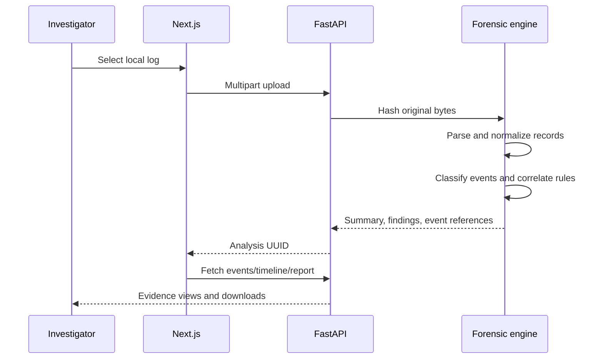

# Forensic workflow

```mermaid
sequenceDiagram
  participant I as Investigator
  participant UI as Next.js
  participant API as FastAPI
  participant E as Forensic engine
  I->>UI: Select local log
  UI->>API: Multipart upload
  API->>E: Hash original bytes
  E->>E: Parse and normalize records
  E->>E: Classify events and correlate rules
  E-->>API: Summary, findings, event references
  API-->>UI: Analysis UUID
  UI->>API: Fetch events/timeline/report
  API-->>I: Evidence views and downloads
```

Malformed records are retained rather than silently discarded. The UI identifies the analysis by UUID, while log content remains in the backend process only.
